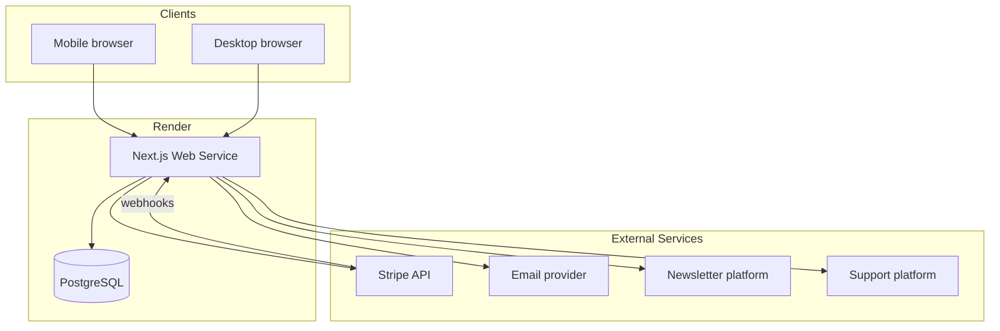
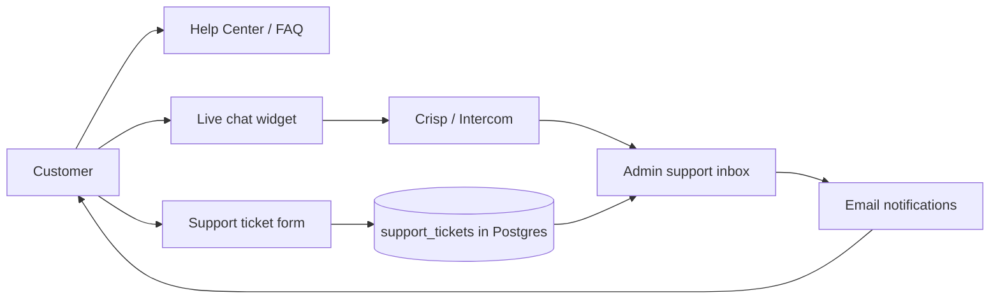

# Flying J Premium Beef — E-Commerce Execution Plan

Full execution plan for a customer storefront, secure payments, order/invoice storage, authentication, marketing (coupons + newsletters), and customer support — with mobile-first design for a premium local beef business.

---

## 1. Goals & Success Criteria

| Goal | Success metric |
|------|----------------|
| Customers can browse and buy online | Complete checkout on phone and desktop |
| Secure payments | Card data never touches your server (Stripe) |
| Orders tracked in a database | Every purchase creates an order + invoice record |
| Protected data | Only authenticated users see their account; admin sees all orders |
| Strong first impression | Fast load, clear branding, works on small screens |
| Marketing drives repeat sales | Coupon redemption tracked; newsletter list grows with opt-in compliance |
| Customers get help quickly | Support tickets answered; common questions deflected via self-service |

**Business-specific notes:**
- Highlight: locally raised, butchered/processed, federally inspected
- Products may be by cut, weight, or bundle (half/quarter cow)
- Local delivery or pickup is likely — plan for that in checkout

---

## 2. Recommended Tech Stack

| Layer | Choice | Why |
|-------|--------|-----|
| **Framework** | Next.js 15 (App Router) | One codebase for site + API; good SEO; strong mobile performance |
| **Language** | TypeScript | Safer data handling for orders and payments |
| **Database** | PostgreSQL (Render Managed Postgres) | Reliable for orders, invoices, inventory, coupons, support |
| **ORM** | Prisma | Schema migrations, type-safe queries |
| **Auth** | Auth.js (NextAuth v5) | Email/password + optional magic link; session-based |
| **Payments** | Stripe Checkout + Stripe Customer Portal | PCI scope minimized; invoices via Stripe |
| **Coupons** | Stripe Promotion Codes + app DB mirror | Stripe applies discounts at checkout; DB tracks campaigns and usage |
| **Newsletters** | Resend Audiences or Mailchimp / ConvertKit | Broadcast email, templates, compliance (unsubscribe) |
| **Customer support** | Crisp, Intercom, or Zendesk (embed) + in-app tickets in DB | Live chat for urgent issues; ticket history tied to orders |
| **Styling** | Tailwind CSS + shadcn/ui | Fast, consistent, responsive UI |
| **Hosting** | Render Web Service + Postgres | Bind to `0.0.0.0:$PORT`; managed Postgres |
| **Email (transactional)** | Resend or SendGrid | Order confirmations, password reset, support updates |

---

## 3. System Architecture



**Roles:**
1. **Guest** — browse products, add to cart, subscribe to newsletter (with consent)
2. **Customer** — login, checkout (with coupon codes), view orders, open support tickets
3. **Admin** (Flying J staff) — manage products, orders, coupons, newsletter sends, support queue

---

## 4. Core Features Breakdown

### 4.1 Public website (marketing + shop)

- **Home** — hero, federally inspected badge, farm story, featured cuts, newsletter signup
- **Shop** — product grid with filters (steaks, ground, bundles)
- **Product detail** — photos, weight options, price, availability, inspection note
- **About / Contact** — local story, pickup location, hours, link to help center
- **Cart** — sticky on mobile, quantity edits, subtotal, coupon code field
- **Help center** — FAQs (pickup, storage, cuts), link to live chat / contact form

### 4.2 Authentication

- Register / login (email + password)
- Password reset via email
- Optional: “continue as guest” with email at checkout (still creates account linkable later)
- **Route protection:** `/account/*`, `/admin/*` require auth; API routes validate session server-side
- Admin role flag in database (`users.role = 'admin' | 'customer'`)

### 4.3 Checkout & payments (Stripe)

**Flow:**
1. Cart → checkout page (shipping/pickup, contact, notes, coupon code)
2. Validate coupon (DB + Stripe Promotion Code)
3. Create Stripe Checkout Session (line items + discounts)
4. Redirect to Stripe hosted payment page
5. Stripe webhook `checkout.session.completed` → create **Order** + **Invoice** in DB; record coupon usage
6. Redirect to success page + send confirmation email

**Stripe setup:**
- Products/prices mirror DB or sync on publish
- Webhooks for: `payment_intent.succeeded`, `charge.refunded`
- Stripe Tax (optional) if selling across state lines
- Customer Portal for receipts (optional phase 2)

### 4.4 Database (orders, invoices, marketing, support)

**Core tables:**

```
users              id, email, password_hash, name, phone, role,
                   newsletter_subscribed, created_at

products           id, name, slug, description, price_cents, weight_label,
                   inventory_count, image_url, active, category, created_at

orders             id, user_id, status, stripe_session_id, stripe_payment_intent,
                   subtotal_cents, discount_cents, tax_cents, total_cents,
                   fulfillment_type, pickup_date, notes, coupon_id, created_at

order_items        id, order_id, product_id, quantity, price_cents, product_name_snapshot

invoices           id, order_id, invoice_number, stripe_invoice_id, pdf_url, issued_at

coupons            id, code, stripe_promotion_code_id, type (percent|fixed),
                   value, min_order_cents, max_uses, uses_count, expires_at,
                   active, campaign_name, created_at

coupon_redemptions id, coupon_id, order_id, user_id, discount_cents, redeemed_at

newsletter_subscribers id, email, user_id (nullable), status (active|unsubscribed),
                       source (footer|checkout|popup), subscribed_at, unsubscribed_at

support_tickets    id, user_id, order_id (nullable), subject, status (open|pending|resolved),
                   priority, created_at, updated_at

support_messages   id, ticket_id, author_type (customer|staff), author_id, body,
                   created_at, is_internal (staff-only notes)
```

**Order statuses:** `pending` → `paid` → `processing` → `ready` → `completed` / `cancelled` / `refunded`

**Invoice numbering:** `FJP-2026-00001` (year + sequence)

### 4.5 Admin dashboard

- Order list with status filters and search
- Mark order ready / completed
- Adjust inventory after sale
- Product CRUD (name, price, stock, images)
- **Coupon management** — create, deactivate, view redemption stats
- **Newsletter** — subscriber list, export, trigger campaigns (via provider)
- **Support queue** — open tickets, assign, reply, link to order
- Export orders CSV for accounting
- Low-stock alerts (optional)

### 4.6 Design system (first impression)

**Brand direction:** premium, local, trustworthy — not generic “red meat” clipart.

| Element | Direction |
|---------|-----------|
| **Colors** | Deep charcoal, cream/off-white, accent copper or barn red |
| **Typography** | Strong serif for headings (e.g. Playfair Display), clean sans for UI (e.g. DM Sans) |
| **Imagery** | Real product/farm photos; badge for “Federally Inspected” |
| **Layout** | Mobile-first; large tap targets; bottom cart bar on mobile |
| **Performance** | Optimized images (Next/Image), target < 3s LCP on 4G |

**Key screens to design first:** Home, Shop, Product, Cart, Checkout, Account orders, Help center, Admin order detail.

---

## 5. Marketing Materials

### 5.1 Coupon codes

**Purpose:** Drive first-time buyers, seasonal promos (e.g. “GRILL2026”), referral rewards, and local event partnerships.

**Types supported:**
| Type | Example | Stripe mapping |
|------|---------|----------------|
| Percent off | 15% off order | Stripe coupon `percent_off` |
| Fixed amount | $10 off | Stripe coupon `amount_off` |
| Free pickup fee | Waive delivery | Custom line-item adjustment or fixed discount |
| Product-specific | Free jerky with bundle | Restrict via `applies_to` products in Stripe |

**Customer experience:**
- Coupon field on cart and checkout (mobile-friendly, clear error messages)
- Auto-apply from URL param (`?code=WELCOME10`) for email campaigns
- Show discount breakdown before payment (subtotal → discount → total)

**Admin experience:**
- Create coupon: code, type, value, min order, max uses, expiry, campaign label
- Sync to Stripe Promotion Code on create (API)
- Dashboard: redemptions, revenue attributed, remaining uses
- Deactivate instantly (DB + Stripe `active: false`)

**Rules & safeguards:**
- One coupon per order (configurable)
- Cannot stack with other promos unless explicitly allowed
- Validate before Checkout Session (stock + min order + expiry + usage limit)
- Record every redemption for accounting

**Implementation phases:**
1. DB schema + admin CRUD + cart validation
2. Stripe Promotion Code sync on checkout
3. URL deep links + email campaign tracking
4. Reporting (campaign ROI in admin)

### 5.2 Newsletters

**Purpose:** Stay in touch with local customers — new cuts, pickup schedules, holiday bundles, farm updates.

**Subscriber capture points:**
| Location | UX |
|----------|-----|
| Site footer | Email + “Subscribe” + consent checkbox |
| Checkout opt-in | Checkbox: “Send me deals and farm news” (pre-checked only if legally allowed in your state) |
| Post-purchase | Success page secondary CTA |
| Account settings | Toggle subscribe / unsubscribe |
| Popup (optional) | First visit or exit-intent — use sparingly on mobile |

**Compliance (required):**
- Clear consent text (CAN-SPAM / state privacy laws)
- One-click unsubscribe in every email
- Sync unsubscribe to DB (`newsletter_subscribers.status`)
- Double opt-in recommended for new subscribers (confirmation email)

**Content types:**
- **Promotional** — sales, coupon codes, limited inventory alerts
- **Educational** — how to cook cuts, storage/safety, federally inspected process
- **Operational** — pickup window changes, holiday hours

**Technical approach:**

**Option A — Integrated (Resend Audiences):**
- Subscribers stored in Resend + mirrored in Postgres
- Admin sends from Resend dashboard or API-triggered templates
- Webhook on unsubscribe updates local DB

**Option B — Dedicated ESP (Mailchimp / ConvertKit):**
- Better templates, automation (welcome series, post-purchase follow-up)
- Embed signup forms; API sync subscribers from checkout
- Segment by: past buyers, newsletter-only, high-value customers

**Automation ideas (post-launch):**
1. Welcome email + `WELCOME10` coupon (7-day expiry)
2. Post-order “thanks + reorder” email 2 weeks later
3. Seasonal campaign (Memorial Day grill, holiday roasts)

**Metrics to track:**
- Subscriber growth rate
- Open / click rates (from ESP)
- Revenue from newsletter-attributed coupons (`campaign_name` on coupons)

---

## 6. Customer Support Platform

### 6.1 Goals

- Answer questions about orders, pickup, product availability, and storage
- Reduce phone tag for a small local business
- Tie every conversation to customer account and order when possible
- Mobile-friendly chat and ticket forms

### 6.2 Recommended architecture (hybrid)

Combine **self-service** (low cost, 24/7) with **human support** (trust for food orders).



### 6.3 Support channels

| Channel | Use case | Tool |
|---------|----------|------|
| **Help center** | Pickup hours, how to store beef, cut descriptions | Static pages + searchable FAQ in Next.js |
| **Live chat** | “Is this in stock?” “When can I pick up?” | Crisp (free tier) or Intercom embed — mobile widget |
| **Email / tickets** | Order issues, wrong item, refund requests | In-app form → `support_tickets` + staff email alert |
| **Order-scoped help** | “Problem with order #FJP-2026-00123” | Button on order detail pre-fills ticket |

### 6.4 Customer experience

**Help center (`/help`):**
- Categories: Orders & pickup, Products & cuts, Payment & refunds, Storage & safety
- Federally inspected / food safety FAQs
- Prominent “Contact us” if FAQ doesn’t help
- Mobile: accordion layout, sticky contact button

**Contact / ticket form:**
- Fields: subject, category, message, optional order ID
- Logged-in users: auto-attach email and recent orders dropdown
- Guests: require email + order number for order-related issues
- Confirmation: “We’ll respond within 1 business day” (set SLA messaging)

**Live chat:**
- Business hours badge (“We’re online” / “Leave a message”)
- Offline mode collects email + message → creates ticket in DB
- Chat history linked to customer email when logged in

**Account area (`/account/support`):**
- List of my tickets and status
- Reply thread (email notification on staff reply)

### 6.5 Admin / staff experience

**Support inbox (admin):**
- Unified view: open tickets + chat escalations (if integrated)
- Filters: open, pending, resolved; by category; by order
- Ticket detail: customer info, linked order, full message thread
- Actions: reply (sends email to customer), change status, internal notes
- Quick links: view order in admin, issue refund in Stripe (manual)

**Notifications:**
- Email to `ADMIN_EMAIL` on new ticket
- Optional SMS for urgent tickets during business hours

### 6.6 Support platform options

| Option | Pros | Cons | Best for |
|--------|------|------|----------|
| **Crisp** | Free tier, easy embed, mobile app for staff | Limited automation on free | Small local business starting out |
| **Intercom** | Strong automation, knowledge base | Higher cost | Growth phase |
| **Zendesk** | Full ticketing, SLA tools | Heavier setup | If support volume is high |
| **DIY (DB only)** | Full control, no extra SaaS cost | No live chat out of box | Budget-conscious; add Crisp later |

**Recommendation:** Start with **Help center + DB tickets + Crisp chat** embedded on site. Staff uses Crisp mobile app for chat and admin dashboard for tickets tied to orders.

### 6.7 Common FAQ content (seed at launch)

1. How do I know my order is ready for pickup?
2. Where is pickup located and what are the hours?
3. How should I store fresh vs frozen beef?
4. What does federally inspected mean?
5. Can I modify or cancel an order?
6. How do refunds work?
7. How do I use a coupon code?
8. How do I unsubscribe from the newsletter?

### 6.8 SLA & policies (publish on site)

- Response time target: 1 business day for tickets; chat during posted hours
- Order issue window: report within 48 hours of pickup
- Refund policy aligned with perishable goods (document clearly)

---

## 7. Security Model

| Concern | Approach |
|---------|----------|
| Database access | No direct DB exposure; all via authenticated API routes |
| Payment data | Stripe only; never store card numbers |
| Sessions | HTTP-only cookies, secure in production |
| Admin | Role check on every admin route + API |
| Webhooks | Verify Stripe signature |
| Input | Validate with Zod on all API inputs |
| HTTPS | Enforced on Render |
| Newsletter | Unsubscribe honored within 10 days (CAN-SPAM); no sharing lists |
| Support | Customers only see their own tickets; staff notes never exposed |

---

## 8. Phased Implementation Plan

### Phase 0 — Discovery & setup

- [ ] Confirm product list, pricing model (per lb vs fixed package)
- [ ] Pickup vs delivery rules and service area
- [ ] Stripe business account + test keys
- [ ] Domain (e.g. `flyingjpremiumbeef.com`)
- [ ] Product photography or placeholder plan
- [ ] Legal: terms, privacy, refund policy (meat sales)
- [ ] Choose newsletter ESP (Resend vs Mailchimp)
- [ ] Choose support chat provider (Crisp recommended)
- [ ] Draft FAQ content and coupon campaign calendar (launch + holidays)

### Phase 1 — Foundation

1. Initialize Next.js + TypeScript + Tailwind + Prisma
2. Render Postgres + env vars
3. Prisma schema + migrations (users, products, orders)
4. Auth.js: register, login, logout, protected routes
5. Base layout: header, footer, mobile nav
6. Deploy to Render (smoke test)

**Deliverable:** Empty shop shell with login working on staging URL.

### Phase 2 — Storefront

1. Seed products (10–20 SKUs)
2. Shop listing + category filters
3. Product detail pages (dynamic `[slug]`)
4. Cart (cookie or DB for logged-in users)
5. Responsive polish on 3 breakpoints

**Deliverable:** Browse and cart without payment.

### Phase 3 — Checkout & Stripe

1. Checkout page (fulfillment options, customer info)
2. Stripe Checkout Session creation
3. Webhook handler → create order + order_items
4. Success / cancel pages
5. Email confirmation on paid order

**Deliverable:** End-to-end test purchase in Stripe test mode.

### Phase 4 — Customer account & invoices

1. `/account/orders` — order history
2. Order detail with line items and status
3. Invoice records + link to Stripe receipt or generated PDF
4. Profile: name, phone, default pickup preference

**Deliverable:** Customer can log in and see past orders.

### Phase 5 — Marketing: coupons & newsletters

1. Coupon DB schema + Stripe Promotion Code sync
2. Cart/checkout coupon field + validation + error UX
3. Admin coupon CRUD + redemption reporting
4. URL param auto-apply (`?code=`)
5. Newsletter subscriber schema + footer signup
6. Checkout newsletter opt-in + account toggle
7. ESP integration (sync subscribers, welcome email template)
8. Unsubscribe page + webhook handler

**Deliverable:** Staff can create `WELCOME10`, customer redeems at checkout; newsletter signup works with compliance.

### Phase 6 — Customer support

1. Help center pages + FAQ content
2. Support ticket schema + API routes
3. Customer ticket form + `/account/support` history
4. “Get help” on order detail (pre-filled order link)
5. Admin support inbox (list, reply, status, internal notes)
6. Email notifications (new ticket, staff reply)
7. Embed Crisp (or chosen provider) with business hours config
8. Offline chat → ticket fallback

**Deliverable:** Customers can self-serve via FAQ, chat during hours, or open tickets; staff manages from admin.

### Phase 7 — Admin & operations

1. Admin layout + role guard
2. Orders management (status updates)
3. Product management
4. Inventory decrement on paid orders
5. Dashboard (# orders today, revenue, open tickets, active coupons)

**Deliverable:** Staff can run day-to-day without database access.

### Phase 8 — Launch hardening

1. Switch Stripe to live mode
2. Custom domain + SSL on Render
3. SEO meta tags, Open Graph, sitemap
4. Error monitoring (e.g. Sentry)
5. Backup strategy for Postgres
6. Load test checkout + coupon path
7. Content: About page, inspection messaging, contact
8. Send launch newsletter to seed list

**Deliverable:** Production launch.

---

## 9. Render Deployment Blueprint (high level)

```yaml
# render.yaml (conceptual)
services:
  - type: web
    name: flying-j-beef
    runtime: node
    buildCommand: npm install && npx prisma migrate deploy && npm run build
    startCommand: npm start
    envVars:
      - key: DATABASE_URL
        fromDatabase:
          name: flying-j-db
          property: connectionString
      - key: STRIPE_SECRET_KEY
        sync: false
      - key: STRIPE_WEBHOOK_SECRET
        sync: false
      - key: NEXTAUTH_SECRET
        generateValue: true
      - key: NEXTAUTH_URL
        value: https://your-domain.onrender.com
      - key: RESEND_API_KEY
        sync: false
      - key: NEWSLETTER_PROVIDER_API_KEY
        sync: false
      - key: CRISP_WEBSITE_ID
        sync: false

databases:
  - name: flying-j-db
    plan: starter
```

---

## 10. Environment Variables Checklist

```
DATABASE_URL
NEXTAUTH_SECRET
NEXTAUTH_URL
STRIPE_SECRET_KEY
STRIPE_PUBLISHABLE_KEY
STRIPE_WEBHOOK_SECRET
EMAIL_API_KEY
NEWSLETTER_API_KEY          # Resend / Mailchimp
ADMIN_EMAIL
CRISP_WEBSITE_ID            # or INTERCOM_APP_ID
SUPPORT_NOTIFICATION_EMAIL
```

---

## 11. Risks & Mitigations

| Risk | Mitigation |
|------|------------|
| Inventory oversell | Check stock before Checkout Session; webhook confirms decrement |
| Webhook missed | Stripe retries; admin reconcile tool; idempotent order creation |
| Coupon abuse | Usage limits, expiry, one-per-customer rules, deactivate in admin |
| Newsletter compliance | Opt-in only, unsubscribe link, sync unsubscribes to DB |
| Support overload | FAQ first; chat hours; ticket SLA messaging |
| Mobile checkout friction | Stripe Checkout; large coupon input on cart |
| Food compliance messaging | Static content reviewed; no medical claims |

---

## 12. Post-launch enhancements (backlog)

- SMS notifications (Twilio) when order is ready
- SMS for support ticket updates
- Subscription / recurring box orders
- Gift cards
- Loyalty or referral program (referral coupon codes)
- Integration with local delivery zones map
- QR code on packaging linking to reorder
- Newsletter automation: abandoned cart emails
- AI-assisted FAQ search

---

## 13. Immediate Next Steps

1. Confirm product model and fulfillment (pickup vs delivery).
2. Confirm newsletter provider and support chat tool.
3. Draft first 3 coupon campaigns (welcome, holiday, referral).
4. Write FAQ answers with Flying J staff input.
5. Begin Phase 1 scaffold in this repo.

---

## Summary

Build **Next.js + PostgreSQL + Stripe + Auth.js** on **Render**, with:

- **Marketing:** Stripe-backed coupon codes with admin management, newsletter capture at multiple touchpoints, ESP integration, and campaign tracking.
- **Support:** Help center + ticket system in the database + live chat embed (Crisp), order-linked help, and admin support inbox.

Mobile-first premium design; customers only see their own data; admins run shop, marketing, and support from one dashboard.
